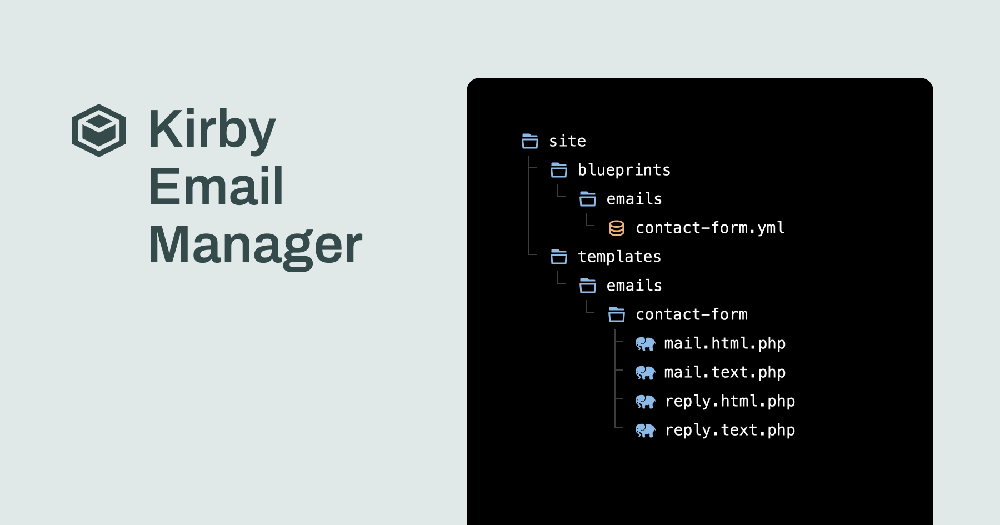

# Kirby Email Manager


The **Email Manager** is a powerful plugin for [Kirby CMS](https://getkirby.com/) that simplifies email form creation and management. Designed for developers, it ensures a seamless experience while giving CMS users the flexibility to adapt content dynamically.



>Complete documentation is available in the [Email Manager Documentation](https://email-manager.philippoehrlein.de).


## Features
- **Quick Setup:** Forms ready in minutes.
- **Customizable:** Adapt snippets and keep layouts flexible.
- **Your Styles:** Use your own CSS classes for full design control.
- **Extensible:** Add custom CAPTCHA solutions and webhooks.
- **Secure:** CSRF protection, validation, optional rate limiting.
- **Spam Protection:** Filters block bots and unwanted submissions.
- **Easy to Use:** Use as blocks or tabs via blueprints; manage in the Panel.
- **Stay Compliant:** Maintain texts and policies directly in the Panel.
- **Multi Email:** Route to different recipients based on user input.


## Installation

### Composer Installation (recommended)

Run the following command in your site's root folder:

```bash
composer require philippoehrlein/kirby-email-manager
```

### Manual Installation

1. Download and extract the plugin
2. Copy the `kirby-email-manager` folder to `/site/plugins/`


## Quick Start
### 1. Configure Kirby for Email Sending

In your Kirby configuration file (`site/config/config.php`), set up the email transport settings. It's recommended to use a noreply email address for sending emails:

```php
return [
    'email' => [
        'noreply' => 'no-reply@yourdomain.com',
        'transport' => [
            'type' => 'smtp',
            'host' => 'smtp.server.com',
            'port' => 465,
            'security' => true,
            'auth' => true,
            'username' => 'SMTP_USERNAME',
            'password' => 'SMTP_PASSWORD'
        ]
    ]
];
```

> ⚠️ Don't store credentials directly in the production configuration. Consider using the [Kirby ENV Plugin](https://github.com/beebmx/kirby-env) to manage sensitive credentials.

### 2. Create the Email Template

#### Blueprint
Create the file `site/blueprints/emails/contact-form.yml`:

```yaml
type: managed-template
name: Contact Form

emails:
  mail:
    subject: Contact Form Submission
    sender: Contact Form

fields:
  name:
    label: Name
    placeholder: Enter your name
    type: text
    required: true
    validate: alpha
    username: true
  email:
    label: Email
    placeholder: Enter your email
    type: email
    required: true
    replyto: true
  message:
    label: Message
    placeholder: Enter your message
    type: textarea
    resizable: vertical
    rows: 6
    required: true
    minlength: 10
```

#### Email Template File
Create `site/templates/emails/contact-form/mail.txt.php`:

```php
From: <?= $form->email() ?>

Name: <?= $form->name() ?>

Message:
<?= $form->message() ?>
```

### 3. Add the Form to a Page

#### Blueprint
Create `site/blueprints/pages/contact.yml`:

```yaml
title: Contact Page

tabs:
  email-manager: email-manager
```

#### Page Template
Create `site/templates/contact.php`:

```php
<?php snippet('email-manager/form-wrapper'); ?>
```

### 4. Create Contact Page

1. In the Kirby panel, create a new page using the **Contact Page** blueprint
2. Select the **Contact Form** template
3. Enter the recipient email address
4. Set up success title and message for form submissions

Your contact form is now ready to use!


## License

- The plugin is distributed under a **proprietary license**.
- **Production use** requires a valid license per publicly accessible domain.
- **Local/Staging** usage is free without a license.
- Source code may be publicly viewable, but **no redistribution or derivative works** are permitted without written consent.
- **Updates**: All future updates are included.

Please read the full license terms in [`LICENSE.md`](./LICENSE.md). For questions, use the contact form on the website.


## Support

- Documentation: https://email-manager.philippoehrlein.de
- Issues: https://github.com/philippoehrlein/kirby-email-manager/issues
- Contact: github@philippoehrlein.de
